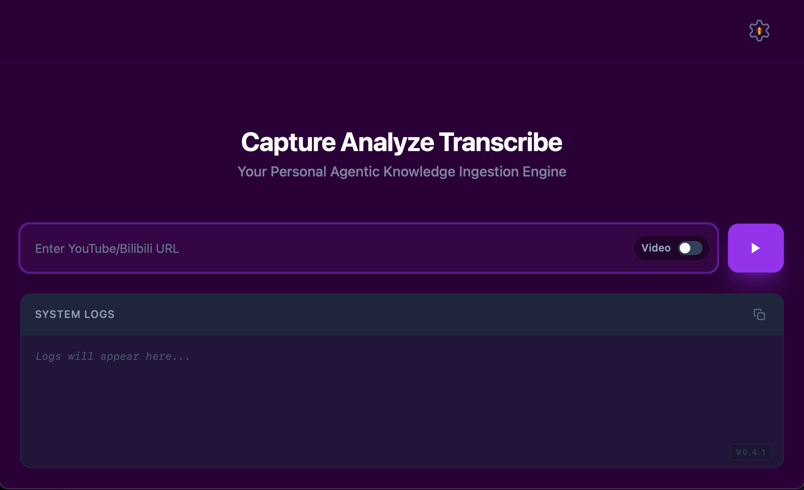
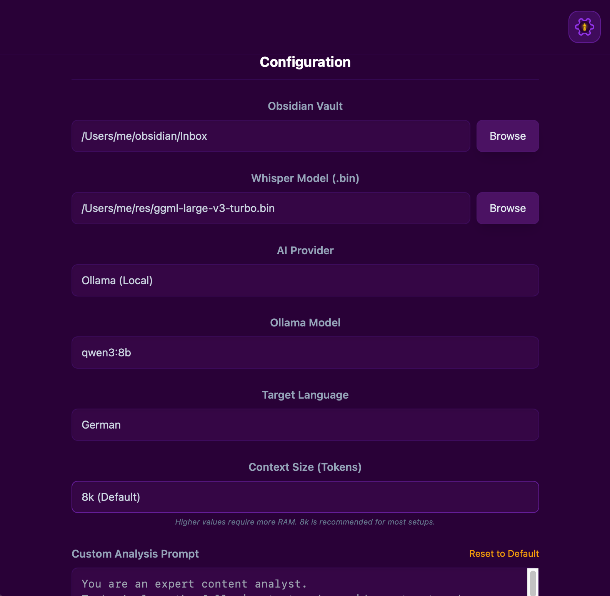

<p align="center">
  
</p>

<h1 align="center">Varys</h1>

<p align="center">
  <strong>Your Personal Agentic Knowledge Ingestion Engine</strong>
</p>

<p align="center">
  
  
  
  
  
</p>

---

Varys is a local-first desktop and CLI application designed to automate the discovery, capture, transcription, and analysis of diverse online content. From YouTube deep-dives to technical blog posts, Varys transforms multimedia and web articles into structured insights, integrating them directly into your Obsidian Vault to build a high-fidelity personal knowledge base.

## Key Features

- **Active Discovery**: Use the new interactive TUI to search for videos and articles across platforms (YouTube, Web) and batch-process them with a single command.
- **Unified Ingestion**: Automatically detects content types. Handles video/audio via high-performance transcription and scrapes web articles via specialized readability engines.
- **Secure by Design**: Sensitive API keys are stored in the OS Keychain (macOS) or Credential Manager, ensuring your credentials never stay in plain-text configuration files.
- **Hardware Accelerated**: Blazing-fast speech-to-text powered by whisper.cpp with Apple Silicon (Metal) optimization.
- **Multi-Provider AI**: Choose between local LLMs (Ollama) or cloud providers (OpenAI) for deep analysis and translation.
- **Flexible Templating**: Fully customizable analysis prompts using a robust template system with {{.Language}} and {{.Content}} placeholders.
- **Obsidian Ready**: Direct export to your vault with formatted Markdown, frontmatter metadata, and embedded media files.

## Technical Architecture

Varys orchestrates a professional-grade stack of intelligence tools:

1. **yt-dlp**: Robust media extraction and metadata retrieval.
2. **Tavily / Search Engines**: Agentic search for cross-platform content discovery.
3. **whisper.cpp**: High-speed, offline transcription optimized for Apple hardware.
4. **Ollama / OpenAI**: Flexible LLM backends for analysis and translation.
5. **go-readability**: Clean content extraction for blog posts and articles.
6. **Wails**: Lightweight, native desktop experience using Go and React.

## Getting Started

### Prerequisites

- **macOS** (Apple Silicon recommended).
- **Ollama**: For local AI capabilities (`brew install ollama`).
- **FFmpeg**: Required for media processing (`brew install ffmpeg`).
- **Tavily API Key** (Optional): For enhanced web discovery features.

### Installation

```bash
make install
```
This installs the Varys Desktop GUI to /Applications and the Standalone CLI (varys-cli) to your system path.

## Usage

Varys can be operated through its Graphical User Interface or directly from the terminal.

### 1. Desktop GUI

The GUI provides a visual experience with real-time logs and live AI analysis streaming.

#### UI Preview

**Main Dashboard**: Paste a supported URL, choose audio or video mode, and monitor processing logs in real time.

<p align="center">
  
</p>

**Configuration Panel**: Set your Obsidian vault, AI provider, and analysis prompt.

<p align="center">
  
</p>

### 2. Agentic Search & Batch Discovery (CLI)

Discover and ingest content using the interactive terminal interface:

```bash
# Search for OpenAI news and choose multiple items to process
varys-cli search "OpenAI latest updates" --provider tavily

# Search for technical videos and download them as full video files
varys-cli search "Next.js 15 tutorial" --provider yt-dlp -v
```
*Interaction: Use [Space] to mark items and [Enter] to start the ingestion pipeline.*

### 3. Direct Ingestion (CLI)

Process a specific URL immediately:

```bash
# Process a video with default settings
varys-cli "https://www.youtube.com/watch?v=..."

# Process a blog post using OpenAI for analysis
varys-cli "https://example.com/blog-post" --ai-provider openai
```

<p align="center">
  
</p>

## Configuration

Varys follows the XDG standard. You can find or sync your configuration at:
- **Config**: ~/.config/Varys/config.json
- **Logs**: ~/Library/Logs/Varys/

## Roadmap
- [x] Web article scraping and analysis.
- [x] Multi-provider translation support.
- [x] Interactive TUI discovery.
- [ ] Native support for local file drag-and-drop.
- [ ] Built-in library view for historical task management.

## License
Varys is released under the MIT License.

<p align="center">
  
</p>
