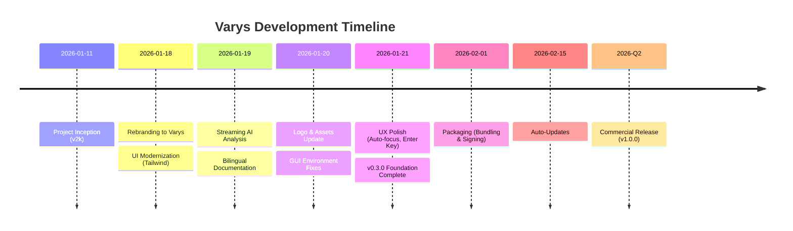

# Varys Roadmap

This document outlines the strategic milestones for Varys, moving from a developer tool to a polished commercial desktop application.

## Milestones Overview

| Milestone | Version | Focus | Status | Target Date |
| :--- | :--- | :--- | :--- | :--- |
| **Foundation & Rebranding** | `v0.3.0` | Core Pipeline, UI Modernization, Rebranding | Completed | Jan 2026 |
| **Packaging & UX Polish** | `v0.4.0` | Dependency Bundling, Auto-Updates, Signed Build | In Progress | Feb 2026 |
| **Commercial Release** | `v1.0.0` | Licensing, Library View, Smart Clips | Planned | Q2 2026 |

## Project Timeline

---

## 1. Milestone: Foundation & Rebranding (v0.3.0)

Establish the core architecture, modernize the UI, and complete the transition from "v2k" to "Varys".

*   **Status:** 100% Complete
*   **Key Features:**
    *   One-Click Capture (YouTube/Bilibili).
    *   Local Transcription (Whisper) & Analysis (Ollama).
    *   Modern Dark UI (Tailwind CSS).
    *   Obsidian Integration.
*   **Documentation:** [Detailed Task List & History](docs/roadmap_v0.3.0_foundation.md)

---

## 2. Milestone: Packaging & UX Polish (v0.4.0)

Eliminate "Developer Friction" to make the app installable and usable by non-technical users.

*   **Status:** 20% Complete
*   **Estimated Effort:** 5-7 Person-Days
*   **Key Features:**
    *   **Dependency Bundling:** Embed `ffmpeg` and `yt-dlp` binaries so Homebrew is not required.
    *   **Onboarding Wizard:** First-run guide to check/install Ollama and download Whisper models automatically.
    *   **Code Signing:** Notarize the macOS app to remove "Unverified Developer" warnings.
    *   **Auto-Update:** Integrate GitHub Releases or Sparkle for seamless updates.
*   **Testing Criteria:**
    *   Clean install on a fresh macOS VM (no Homebrew) -> App works immediately.
    *   `make install` works without errors.
*   **Detailed Plan:** [Task List & Design](docs/roadmap_v0.4.0_packaging.md)

---

## 3. Milestone: Commercial Release (v1.0.0)

Implement features that drive paid adoption and long-term retention.

*   **Status:** Planning
*   **Estimated Effort:** 15-20 Person-Days
*   **Key Features:**
    *   **License Management:** Integration with Lemon Squeezy / Gumroad.
    *   **Library View:** In-app history of processed videos with playback and summary review.
    *   **Smart Clip Mode:** Segment-specific capture (e.g., "Clip 10:00-12:00").
    *   **Export Options:** PDF, Notion, and Tana support.
*   **Dependencies:** Apple Developer Account ($99).
*   **Detailed Plan:** [Task List & Design](docs/roadmap_v1.0.0_commercial.md)