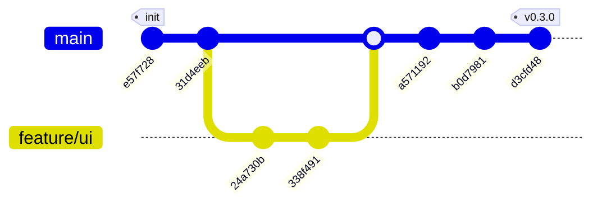

# Milestone 1: Foundation & Rebranding (v0.3.0)

**Status:** Completed
**Timeline:** Jan 2026

## Goal
Establish Varys as a standalone, modern desktop application by migrating from the legacy Python script (`v2k`), implementing a professional UI with Tailwind CSS, and ensuring robust local AI integration.

## Git History Graph

## Delivered Features

### 1. Rebranding (v2k -> Varys)
- [x] Renamed project root and module paths to `Varys`.
- [x] Updated all documentation (`README.md`, `GEMINI.md`) to reflect the new identity.
- [x] Designed and implemented a new Logo (Grayscale V-Wave).
- [x] Updated `Makefile` and build artifacts (`.app` bundle) to use "Varys".

### 2. UI Modernization
- [x] **Tailwind CSS Integration:** Replaced custom CSS with utility-first styling.
- [x] **Dark Theme:** Implemented a consistent "Slate" color palette (`bg-slate-900`).
- [x] **Dashboard:** Created a dual-pane view for System Logs and Live Analysis.
- [x] **Settings:** Designed a clean configuration interface with status indicators.
- [x] **UX Polish:**
    - Auto-focus URL input on launch.
    - "Enter" key support for submission.
    - Preserved state between tab switches (CSS visibility toggle).

### 3. Core Pipeline Architecture
- [x] **Backend Modules:** Separated concerns into `downloader`, `transcriber`, `analyzer`, and `storage`.
- [x] **Streaming Analysis:** Implemented real-time token streaming from Ollama to the Frontend.
- [x] **Progress Feedback:** Enabled Whisper timestamp logging to provide a "heartbeat" during long transcriptions.
- [x] **Config Management:** Migrated to `os.UserConfigDir()` (`~/Library/Application Support/Varys`) for standards compliance.

### 4. System Resilience
- [x] **PATH Injection:** Solved the "GUI vs CLI" environment issue by injecting Homebrew paths (`/opt/homebrew/bin`) on startup.
- [x] **Cookie Support:** Integrated `yt-dlp` cookie passing for authentication.
