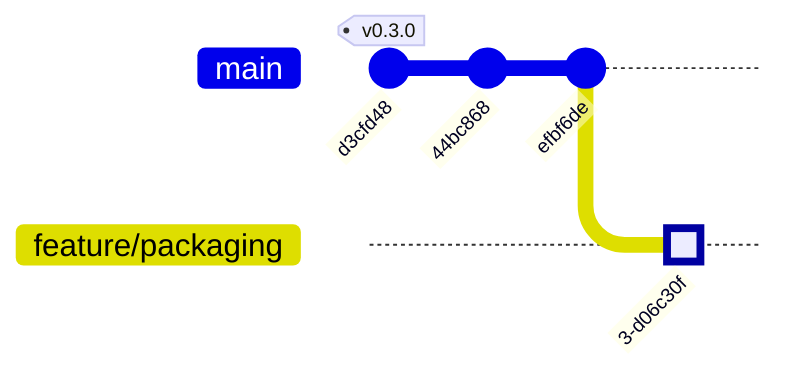

# Milestone 2: Packaging & UX Polish (v0.4.0)

**Status:** In Progress
**Target:** Feb 2026
**Focus:** Removing "Developer Friction" to create a standalone, install-and-run product.

## Goal
Ensure that a non-technical user can download `Varys.app`, drag it to Applications, and start using it without opening a terminal or installing Homebrew.

## Git History Graph

## Task List

### 1. Dependency Bundling (The "No-Homebrew" Goal)
Currently, Varys relies on `yt-dlp` and `ffmpeg` being in the system PATH.
- [x] **Video Download Support:** Implemented toggle for Audio/Video download modes (v0.3.1).
- [ ] **Strategy:** Use `embed` or download-on-demand to place binaries in `Varys.app/Contents/Resources`.
- [ ] **Implementation:**
    - Update `backend/dependency` to prefer bundled binaries over system ones.
    - Add a `scripts/download_deps.sh` to fetch `yt-dlp` (macOS arm64) and `ffmpeg` (static build) during `make build`.
    - Update `wails.json` or `Makefile` to include these in the final bundle.

### 2. Onboarding Wizard (First Run Experience)
- [ ] **Design:** A modal or separate route (`/welcome`) that appears if config is missing or invalid.
- [ ] **Step 1: AI Check:**
    - Detect if `ollama` is running.
    - If not, provide a download link or (advanced) attempt to install/start it.
- [ ] **Step 2: Whisper Model:**
    - Check for `ggml-large-v3-turbo.bin` in `~/Library/Application Support/Varys/models`.
    - If missing, offer a "Download Default Model" button (with progress bar).
- [ ] **Step 3: Vault Setup:**
    - Prompt user to select Obsidian Vault immediately.

### 3. Auto-Update Mechanism
- [ ] **Strategy:** "Option A" (GitHub Release Poller).
- [ ] **Backend:** Implement `CheckForUpdates()` querying GitHub API.
- [ ] **Frontend:** Add a "New Update Available" banner in Settings with a direct download link.

### 4. Code Signing & Notarization
- [ ] **Certificate:** Acquire Apple Developer ID ($99).
- [ ] **Entitlements:** Create `entitlements.plist` (crucial for `yt-dlp` network access and JIT execution).
- [ ] **Automation:** Add `codesign` and `xcrun notarytool` steps to `Makefile`.

## Testing Criteria

1.  **VM Test:** Spin up a clean macOS VM (e.g., using Tart or UTM) with *no* dev tools installed.
2.  **Install:** Drag `Varys.app` to Applications.
3.  **Launch:** App opens without crashing.
4.  **Onboarding:** Wizard guides through Model download.
5.  **Execution:** "Process" button works (uses bundled `yt-dlp` + `ffmpeg`).

## Progress Tracker

| Task | Status | Owner |
| :--- | :--- | :--- |
| Dependency Script | ⬜ Todo | @deChn |
| Bundling Logic | ⬜ Todo | @deChn |
| Onboarding UI | ⬜ Todo | @deChn |
| Update Poller | ⬜ Todo | @deChn |
| Code Signing | ⬜ Blocked (Need ID) | @deChn |